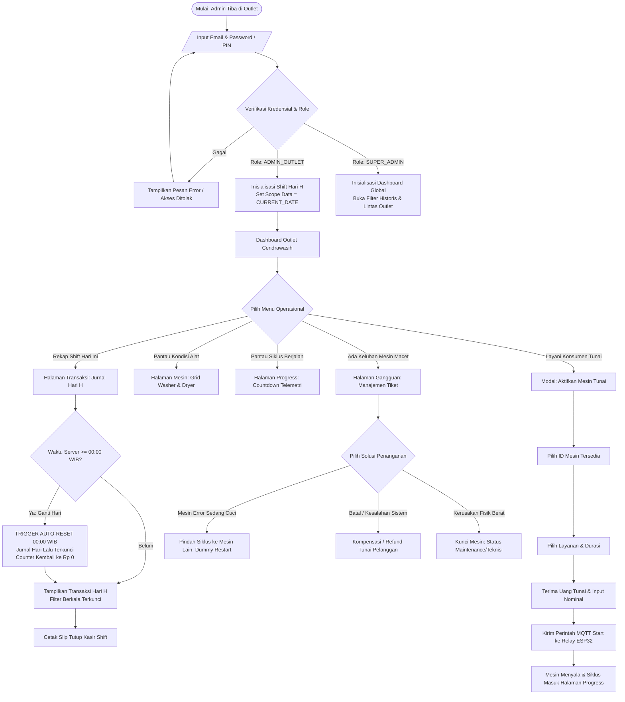
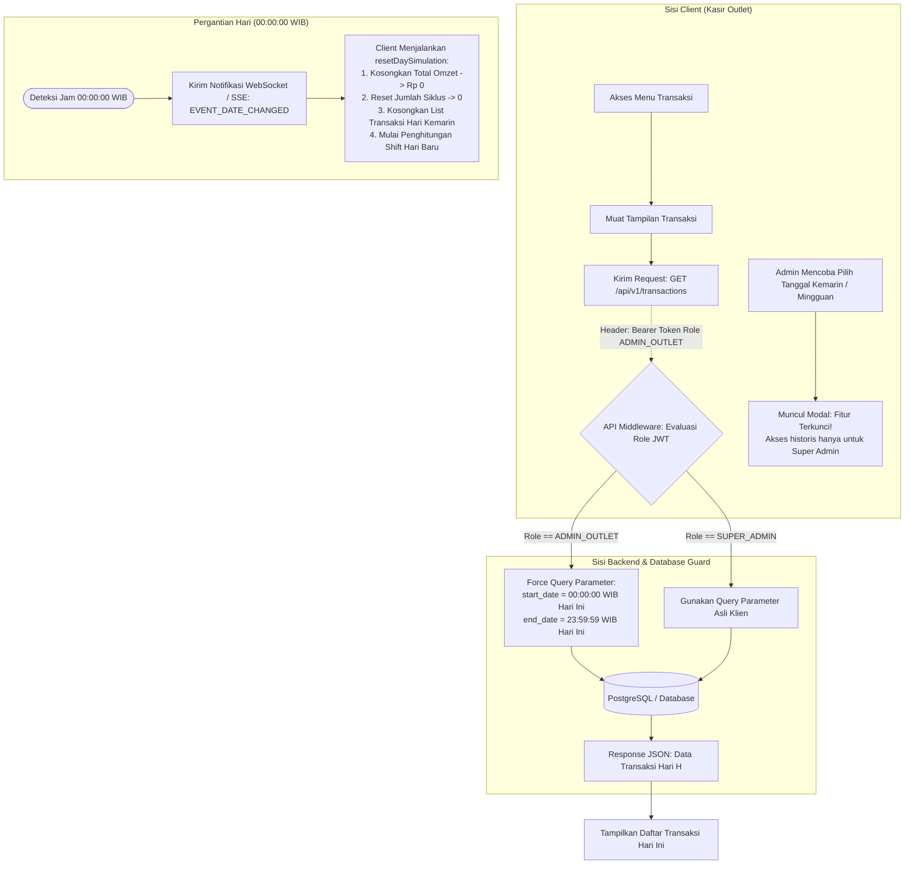
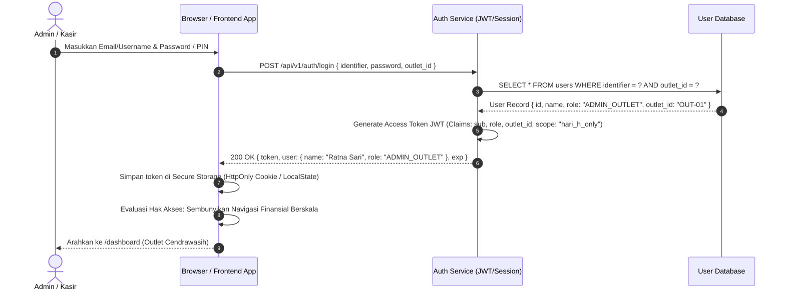
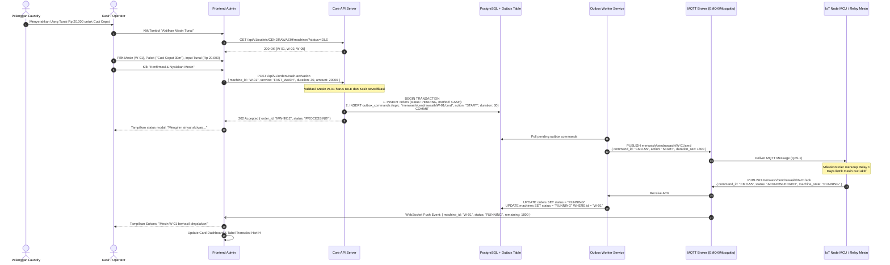
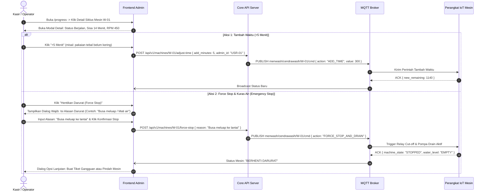
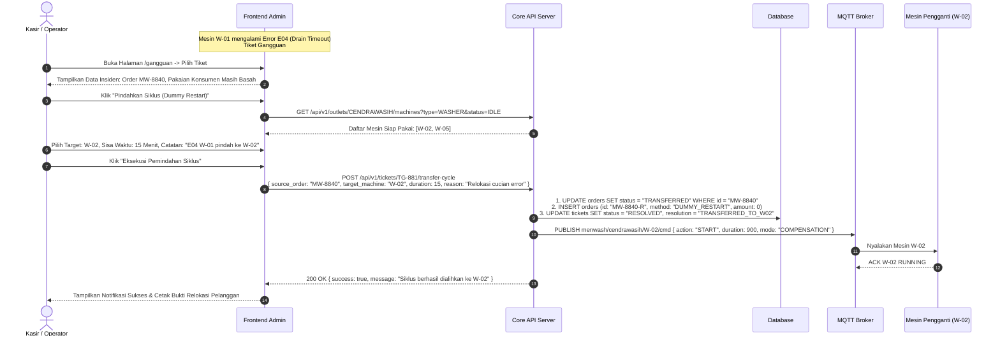
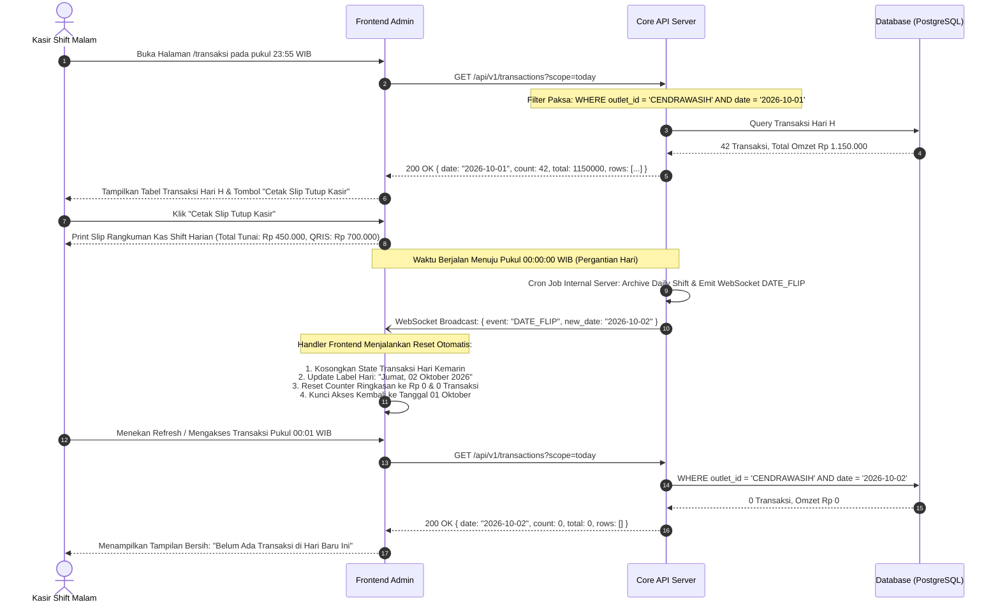

# Product Requirements Document (PRD) & Blueprint Arsitektur: Menwash Admin

**Dokumen Referensi Mutlak (Single Source of Truth) untuk Migrasi UI Static ke Production Framework**  
**Nama File:** `flow_admin.md`  
**Versi:** 3.0.0  
**Tanggal Rilis:** 2026-10-01  
**Status:** Approved for Engineering Implementation  
**Target Framework:** Next.js (App Router) / Vue 3 / Nuxt / Laravel Inertia / React + NestJS  

---

## 1. Ringkasan Eksekutif & Tujuan Produk

**Menwash Admin** adalah sistem cockpit operasional terpusat untuk outlet self-service laundromat komersial berbasis IoT (Internet of Things). Sistem ini menghubungkan:
1. **Perangkat Keras (Hardware)**: Mesin cuci (*Washer*) & mesin pengering (*Dryer*) komersial yang dikontrol via mikrokontroler (ESP32/Relay board) melalui protokol MQTT.
2. **Koleksi Pembayaran**: QRIS Dinamis (otomatis) dan Transaksi Tunai Kasir (*Manual Cash Activation*).
3. **Petugas Lapangan**: Kasir / Operator Outlet yang bertugas menjaga kelancaran harian, menangani keluhan, dan memicu siklus mesin.
4. **Manajemen / Owner**: Super Admin yang memiliki visibilitas finansial menyeluruh dan hak akses audit berskala.

### Kebijakan Utama Bisnis (Strict Policy)
* **Prinsip "Hari H" (Single-Day Visibility for Cashier/Admin Outlet)**:
  Petugas Admin Toko / Kasir **hanya berhak memantau omzet, kas, dan jurnal transaksi pada hari berjalan (Hari H)**. Tepat pada pergantian hari (**pukul 00:00 WIB**), seluruh data tampilan harian kasir akan **ter-reset bersih** menjadi 0. Kasir **tidak memiliki izin (Forbidden 403)** untuk melihat laporan mundur, kemarin, mingguan, bulanan, atau tahunan. Akses historis tersebut adalah **hak mutlak Super Admin / Owner**.

---

## 2. Matriks Hak Akses & Role-Based Access Control (RBAC)

### 2.1 Definisi Peran (User Roles)

| Role ID | Nama Peran | Deskripsi Operasional | Cakupan Akses |
|---|---|---|---|
| `SUPER_ADMIN` | Super Admin / Owner | Pemilik bisnis atau head of operations pusat dengan hak akses penuh ke seluruh outlet, keuangan historis, konfigurasi tarif, dan audit trail. | Lintas Outlet (Global), Historis Tanpa Batas (Hari H + Berskala). |
| `ADMIN_OUTLET` | Admin Outlet / Kasir / Operator | Petugas jaga shift di gerai fisik. Bertanggung jawab atas pelayanan pelanggan tunai, pemantauan mesin berjalan, penanganan gangguan darurat, dan tutup kasir shift harian. | Khusus Outlet Terdaftar, **Hanya Data Hari H (00:00 - 23:59 WIB)**. |
| `TEKNISI` | Teknisi / Maintenance Field Engineer | Petugas teknis hardware yang menangani perbaikan fisik mesin, kalibrasi relay IoT, dan bypass maintenance. | Khusus Outlet Terdaftar, Tab Mesin, Gangguan, dan Simulator Debug. |

---

### 2.2 Matriks Hak Akses Fitur & Halaman

| Fitur / Halaman | `SUPER_ADMIN` | `ADMIN_OUTLET` (Kasir) | `TEKNISI` | Catatan Kebijakan Teknis |
|---|:---:|:---:|:---:|---|
| **Login (`/login`)** | ✅ Ya | ✅ Ya | ✅ Ya | Autentikasi dengan Email/PIN & Role Verification |
| **Dashboard (`/dashboard`)** | ✅ Ya | ✅ Ya (Hari H) | ⚠️ Terbatas | Widget pendapatan kasir hanya menampilkan omzet Hari H |
| **Monitoring Mesin (`/mesin`)** | ✅ Ya | ✅ Ya | ✅ Ya | Status live Washer/Dryer, trigger aktivasi & kontrol |
| **Drawer Detail Mesin** | ✅ Ya | ✅ Ya | ✅ Ya | Telemetri RPM, suhu, vibrasi, cycle count, MQTT topic |
| **Aktivasi Mesin Tunai (Wizard QA)**| ✅ Ya | ✅ Ya | ❌ Tidak | Kasir menerima cash dan memicu relay mesin |
| **Progress Siklus (`/progress`)** | ✅ Ya | ✅ Ya | ✅ Ya | Countdown sisa menit, tahapan pencucian |
| **Kontrol Darurat (+5m, Pause, Force Stop)**| ✅ Ya | ✅ Ya (Wajib Catat Alasan) | ✅ Ya | Wajib mengisi alasan untuk audit log jika siklus berbayar |
| **Tiket Gangguan (`/gangguan`)** | ✅ Ya | ✅ Ya | ✅ Ya | Laporan error (E01, E03, E04, E08, Offline) |
| **Penyelesaian Gangguan (Transfer Siklus)** | ✅ Ya | ✅ Ya | ✅ Ya | Memindahkan sisa durasi cucian ke mesin lain |
| **Kompensasi / Refund Tunai** | ✅ Ya | ✅ Ya (Limit Harian) | ❌ Tidak | Kasir mengembalikan dana tunai ke pelanggan |
| **Transaksi Hari H (`/transaksi`)** | ✅ Ya | ✅ Ya (Hari H Saja) | ❌ Tidak | Data transaksi 00:00 s/d 23:59 WIB hari ini |
| **Laporan Finansial Berskala (Mingguan/Bulanan)**| ✅ Ya | 🚫 **DILARANG (Locked)**| ❌ Tidak | Backend mengembalikan `403 Forbidden` jika Kasir meminta range tanggal lampau |
| **Cetak Slip Tutup Kasir (End of Day)**| ✅ Ya | ✅ Ya (Shift Hari H) | ❌ Tidak | Ringkasan setor tunai dan total QRIS shift hari H |
| **Ekspor Laporan Historis CSV/PDF** | ✅ Ya | 🚫 **DILARANG** | ❌ Tidak | Hanya Super Admin yang berhak ekspor data berkala |
| **Simulator / Debug Mesin (`/debug/simulator`)**| ✅ Ya | ⚠️ Read-only Test | ✅ Penuh | Uji coba MQTT heartbeat, relay pulse, dan injeksi error |

---

### 2.3 Matriks Penegakan Kebijakan Finansial "Hari H"

| Parameter Kebijakan | Aturan untuk `ADMIN_OUTLET` (Kasir) | Aturan untuk `SUPER_ADMIN` (Owner) |
|---|---|---|
| **Rentang Waktu Data** | Hanya `CURRENT_DATE` (00:00:00 s/d 23:59:59 WIB). | Fleksibel: Hari H, Kemarin, 7 Hari, 30 Hari, Custom Range, YTD. |
| **Filter Tanggal UI** | Dinonaktifkan / Dikunci dengan badge visual `[🔒 Khusus Super Admin]`. | Tersedia Date Range Picker lengkap (Flatpickr/Datepicker). |
| **Perilaku Jam 00:00 WIB** | Counter pendapatan, transaksi, dan grafik ter-reset menjadi Rp 0 secara otomatis. | Data hari sebelumnya diarsipkan ke laporan historis bulanan. |
| **Akses Data Kemarin** | **Tertutup Mutlak**. Kasir tidak dapat melihat saldo kas kemarin untuk mencegah manipulasi fisik. | Terbuka penuh untuk verifikasi setoran fisik kasir. |
| **Simulasi Pergantian Hari** | Disediakan tombol khusus demonstrasi/pengujian untuk memverifikasi reset 00:00 WIB. | N/A (Produksi riil mengikuti cron job server). |

---

## 3. Arsitektur Informasi & Pemetaan Rute

```
menwash-admin/
├── login.html           --> /login                  (Autentikasi & Seleksi Role)
├── dashboard.html       --> /dashboard              (Operational Cockpit & Quick Telemetry)
├── mesin.html           --> /mesin                  (Grid Unit Washer & Dryer + Device Drawer)
├── progress.html        --> /progress               (Live Cycle Monitor + Emergency Controller)
├── gangguan.html        --> /gangguan               (Trouble Ticket Management & Resolution)
├── transaksi.html       --> /transaksi              (Jurnal Hari H + Tutup Kasir + Reset Guard)
└── dummy-restart.html   --> /debug/simulator        (Hardware & MQTT Testing Utility)
```

---

## 4. Flowchart Alur Bisnis (Mermaid)

### 4.1 Alur Utama Operasional Admin Outlet



---

### 4.2 Alur Kebijakan Finansial "Hari H" & Proteksi Pergantian Hari



---

## 5. Sequence Diagram Alur Operasional (Mermaid)

### 5.1 Sequence 1: Autentikasi & Resolusi Role (RBAC)



---

### 5.2 Sequence 2: Aktivasi Mesin Tunai (Wizard QA) & Trigger Hardware MQTT



---

### 5.3 Sequence 3: Kontrol Darurat Siklus (Pause, Add Time, Force Stop)



---

### 5.4 Sequence 4: Penanganan Gangguan & Pemindahan Mesin (Dummy Restart)



---

### 5.5 Sequence 5: Penegakan "Hari H" & Mekanisme Auto-Reset 00:00 WIB



---

## 6. Spesifikasi Detail Antarmuka & Logika Fitur (Page-by-Page)

### 6.1 Halaman Login (`/login`)
* **File Rujukan UI**: `login.html`
* **Tujuan**: Pintu masuk petugas kasir, operator, dan super admin dengan verifikasi gerai.
* **Elemen UI Utama**:
  1. Card Semi-Clay dengan branding logo `logomenwash.svg`.
  2. Input Identifikasi: Email atau Nomor Handphone / Username.
  3. Input Kredensial: Password atau PIN Kasir 6-digit.
  4. Selector Gerai / Outlet: Default "Outlet Cendrawasih" (auto-detect via subdomain/localStorage).
  5. Indikator Telemetri Real-Time Gerai: "12/13 Mesin Beroperasi Optimal".
* **Validasi & Error Handling**:
  - Kredensial salah: `401 Unauthorized` -> Shake effect pada kartu login & teks peringatan merah.
  - Akun dinonaktifkan: Tampilkan pesan hubungi Super Admin.
  - Sesi kedaluwarsa: Redirect otomatis ke `/login?reason=session_expired`.

---

### 6.2 Halaman Dashboard (`/dashboard`)
* **File Rujukan UI**: `dashboard.html`
* **Tujuan**: Kokpit ringkasan cepat status outlet, ketersediaan mesin, dan statistik hari H.
* **Komponen & Aturan Bisnis**:
  1. **Banner Status Gerai**: Menampilkan nama outlet, konektivitas IoT (Status: Online/MQTT Connected), dan tombol aktivasi cepat.
  2. **4 KPI Stat Cards (Khusus Hari H untuk Kasir)**:
     - *Omzet Tunai & QRIS Hari H*: Total Rupiah terhitung sejak 00:00 WIB hari ini.
     - *Mesin Aktif / Total*: Rasio unit menyala vs total unit (contoh: 12/13 Mesin).
     - *Total Siklus Hari H*: Jumlah pencucian/pengeringan selesai hari ini.
     - *Gangguan Aktif*: Jumlah tiket error yang belum terselesaikan.
  3. **Cluster Monitoring Cepat Mesin**:
     - Washer Cluster: W-01 s/d W-08 (Warna: Hijau=Ready, Biru=Running, Kuning=Done/Door Locked, Merah=Error).
     - Dryer Cluster: D-01 s/d D-05.
  4. **Widget Aktivasi Cepat Tunai**: Tombol mengambang (FAB) & widget langsung untuk membuka Modal Wizard Aktivasi Kasir.

---

### 6.3 Halaman Monitoring Mesin (`/mesin`)
* **File Rujukan UI**: `mesin.html`
* **Tujuan**: Visualisasi detail inventaris hardware mesin cuci dan pengering serta remote command.
* **Komponen & Fitur**:
  1. **Tab Filter Mesin**: Semua, Washer (Mesin Cuci), Dryer (Pengering), Siap Pakai, Berjalan, Gangguan, Offline.
  2. **Kartu Unit Mesin (Device Card)**:
     - Nama Mesin (e.g. `Washer #01 - Primus 10kg`).
     - Badge Status Real-Time dengan indikator denyut nadi (Pulse dot).
     - Live Countdown Timer jika sedang berjalan.
     - Tombol Aksi Cepat: `Detail Telemetri`, `Mulai Manual`, `Emergency Stop`.
  3. **Slide-Over Drawer Detail Mesin**:
     - *Header*: Status koneksi hardware relay ESP32 (RSSI WiFi, IP Lokal, Firmware Ver).
     - *Sensor Readings*: Tegangan listrik (Volt), Arus (Ampere), RPM drum, Estimasi Suhu (°C), Getaran (Vibration sensor).
     - *Action Bar*:
       - `Kirim Pulse Relay Manual` (Test hardware).
       - `Bypass Siklus Gratis` (Khusus kompensasi/uji coba).
       - `Kunci Perawatan (Maintenance Lock)`: Mencegah mesin dipilih di sistem pembayaran QRIS pelanggan.

---

### 6.4 Halaman Progress Siklus (`/progress`)
* **File Rujukan UI**: `progress.html`
* **Tujuan**: Pemantauan langsung tahap demi tahap cucian yang sedang aktif di outlet.
* **Komponen & Fitur**:
  1. **Filter Status Siklus**: Semua Siklus, Pencucian (Wash), Pengeringan (Dry), Kritis (< 5 Menit).
  2. **Kartu Siklus Berjalan (Active Cycle Card)**:
     - ID Mesin & Nama Konsumen / Nomor Order.
     - Progress Bar Visual (0% - 100%) dengan warna dinamis.
     - Tahapan Siklus: `Mengisi Air (Fill)` -> `Mencuci (Wash)` -> `Bilas (Rinse)` -> `Peras (Spin)` -> `Selesai`.
     - Parameter Real-Time: Suhu air, Kecepatan putaran drum, Sisa waktu digital (`MM:SS`).
  3. **Modal Kontrol Darurat Mesin**:
     - Tombol `Pause / Jeda Sementara`: Menghentikan putaran motor tanpa membuang air.
     - Tombol `+5 Menit Tambahan`: Menambah pulsa timer pengeringan.
     - Tombol `Force Stop & Kuras Air`: Mematikan mesin total & membuka katup pembuangan air jika terjadi anomali muatan/busa.

---

### 6.5 Halaman Transaksi Kasir (`/transaksi`) — Strict "Hari H" Policy
* **File Rujukan UI**: `transaksi.html`
* **Tujuan**: Pencatatan jurnal transaksi kasir, rekonsiliasi kas tunai shift, dan bukti setor.
* **Spesifikasi Ketat Hak Akses**:
  1. **Scope Terkunci (Hari H Only)**:
     - Teks Banner Kebijakan: *"Mode Shift Kasir: Menampilkan transaksi hari ini saja. Data akan otomatis ter-reset setiap pukul 00:00 WIB."*
     - Filter Tanggal Berkala Dinonaktifkan: Tombol Mingguan / Bulanan diberi ikon gembok 🔒.
     - Jika Kasir mengeklik area filter tanggal: Muncul modal edukasi `periodicLockModal` yang menjelaskan bahwa laporan berskala hanya dapat diakses melalui portal Super Admin.
  2. **Simulasi Pergantian Hari (Testing Tool)**:
     - Tombol *"Simulasi Ganti Hari (00:00 WIB)"* untuk mendemonstrasikan bahwa sistem otomatis mengosongkan jurnal dan me-reset summary counter menjadi Rp 0.
  3. **Tabel Transaksi Hari H**:
     - Kolom: ID Transaksi, Mesin, Layanan/Paket, Metode Pembayaran (QRIS / Tunai / Dummy), Jam (WIB), Petugas Kasir, Status (Sukses / Berjalan / Batal).
     - Filter Khusus Hari H: Filter berdasarkan Metode Pembayaran (Semua, Tunai Kasir, QRIS Digital, Dummy Restart) dan Pencarian ID Transaksi / Nomor Pelanggan.
  4. **Aksi Penutupan Shift**:
     - `Cetak Slip Tutup Kasir`: Menghasilkan layout struk thermal 80mm berisi total penerimaan uang tunai laci untuk diserahkan ke shift berikutnya.
     - `Ekspor Jurnal Hari H`: Mengunduh ringkasan CSV untuk transaksi hari ini saja.

---

### 6.6 Halaman Manajemen Gangguan (`/gangguan`)
* **File Rujukan UI**: `gangguan.html`
* **Tujuan**: Resolusi cepat insiden kendala mesin atau keluhan pelanggan di outlet.
* **Katalog Kode Gangguan & Resolusi**:
  - `E01 - Water Inflow Failure`: Pasokan air terhambat / kran tertutup. Resolusi: Periksa kran & kirim sinyal resume.
  - `E03 - Unbalanced Load`: Pakaian menggumpal di satu sisi drum. Resolusi: Buka pintu manual, ratakan pakaian, reset.
  - `E04 - Drain Timeout`: Saluran pembuangan tersumbat koin/kancing. Resolusi: Kuras manual & pindahkan siklus ke mesin lain.
  - `E08 - Dryer Overheating`: Suhu pengering melebihi 75°C. Resolusi: Pendinginan otomatis, bersihkan filter serat (*lint filter*).
  - `OFFLINE - Hardware Disconnect`: Hilang sinyal MQTT / mati listrik. Resolusi: Ping network / restart adaptor ESP32.
* **Fitur Penanganan**:
  - Tombol `Pindahkan Cucian (Dummy Restart)`: Memindahkan sisa durasi ke mesin lain yang sedang kosong tanpa memungut bayaran pelanggan.
  - Tombol `Refund Tunai`: Kasir mengeluarkan kas pengganti dengan bukti tanda terima sistem.
  - Tombol `Eskalasi ke Teknisi`: Mengubah status mesin menjadi `OUT_OF_SERVICE` dan mengirim notifikasi WhatsApp/Telegram ke tim teknisi.

---

### 6.7 Halaman Simulator / Debug (`/debug/simulator`)
* **File Rujukan UI**: `dummy-restart.html`
* **Tujuan**: Lingkungan simulasi hardware untuk pengujian end-to-end tanpa perlu menyalakan mesin fisik.
* **Fitur Simulator**:
  - Simulasi pengiriman payload MQTT `STATUS`, `ACK`, dan `ERROR`.
  - Tombol injeksi kode error (E01 s/d E08) untuk menguji respons UI di `/gangguan`.
  - Simulasi Webhook pembayaran QRIS sukses dari Payment Gateway (Midtrans/Xendit).

---

## 7. Kontrak Integrasi Protokol IoT (MQTT)

### 7.1 Skema Penamaan Topik MQTT
Format: `menwash/{outlet_id}/{machine_id}/{action_type}`

| Topik | Arah | Fungsi | QoS | Retain |
|---|:---:|---|:---:|:---:|
| `menwash/cendrawasih/{id}/cmd` | Cloud -> Mesin | Mengirim perintah (START, STOP, PAUSE, RESUME, ADD_TIME) | 1 | False |
| `menwash/cendrawasih/{id}/ack` | Mesin -> Cloud | Konfirmasi penerimaan dan eksekusi perintah | 1 | False |
| `menwash/cendrawasih/{id}/telemetry` | Mesin -> Cloud | Laporan berkala sensor (RPM, voltase, sisa detik, suhu) | 0 | False |
| `menwash/cendrawasih/{id}/status` | Mesin -> Cloud | Laporan status ketersediaan (IDLE, RUNNING, ERROR, OFFLINE) | 1 | True |
| `menwash/cendrawasih/{id}/alert` | Mesin -> Cloud | Notifikasi darurat / kode error instan (E01, E03, E04) | 1 | False |

### 7.2 Contoh Payload Perintah (`/cmd`)
```json
{
  "command_id": "CMD-20261001-0941",
  "action": "START",
  "service_type": "FAST_WASH",
  "duration_seconds": 1800,
  "relay_channel": 1,
  "pulse_ms": 500,
  "created_at": "2026-10-01T21:45:00Z"
}
```

### 7.3 Contoh Payload Telemetri (`/telemetry`)
```json
{
  "machine_id": "W-01",
  "cycle_step": "WASHING",
  "elapsed_seconds": 600,
  "remaining_seconds": 1200,
  "drum_rpm": 450,
  "water_temp_c": 38.5,
  "voltage_v": 221.4,
  "current_a": 3.8,
  "door_locked": true
}
```

---

## 8. Skema Basis Data & Aturan Penjagaan Query (Database Guard)

### 8.1 Skema Tabel Inti (PostgreSQL DDL Reference)

```sql
-- 1. Tabel Outlet
CREATE TABLE outlets (
    id VARCHAR(50) PRIMARY KEY,
    name VARCHAR(100) NOT NULL,
    address TEXT,
    timezone VARCHAR(50) DEFAULT 'Asia/Jakarta',
    is_active BOOLEAN DEFAULT TRUE,
    created_at TIMESTAMP WITH TIME ZONE DEFAULT NOW()
);

-- 2. Tabel Peran & Pengguna
CREATE TYPE user_role AS ENUM ('SUPER_ADMIN', 'ADMIN_OUTLET', 'TEKNISI');

CREATE TABLE users (
    id VARCHAR(50) PRIMARY KEY,
    outlet_id VARCHAR(50) REFERENCES outlets(id),
    name VARCHAR(100) NOT NULL,
    email VARCHAR(100) UNIQUE NOT NULL,
    phone VARCHAR(20),
    password_hash TEXT NOT NULL,
    pin_hash VARCHAR(10),
    role user_role NOT NULL DEFAULT 'ADMIN_OUTLET',
    is_active BOOLEAN DEFAULT TRUE,
    created_at TIMESTAMP WITH TIME ZONE DEFAULT NOW()
);

-- 3. Tabel Unit Mesin
CREATE TYPE machine_type AS ENUM ('WASHER', 'DRYER');
CREATE TYPE machine_status AS ENUM ('IDLE', 'RUNNING', 'ERROR', 'MAINTENANCE', 'OFFLINE');

CREATE TABLE machines (
    id VARCHAR(50) PRIMARY KEY,
    outlet_id VARCHAR(50) REFERENCES outlets(id),
    code VARCHAR(20) NOT NULL, -- Contoh: W-01, D-01
    name VARCHAR(100) NOT NULL,
    type machine_type NOT NULL,
    capacity_kg NUMERIC(4,1) NOT NULL,
    status machine_status DEFAULT 'IDLE',
    relay_pin INT DEFAULT 1,
    ip_address VARCHAR(45),
    total_cycles INT DEFAULT 0,
    created_at TIMESTAMP WITH TIME ZONE DEFAULT NOW()
);

-- 4. Tabel Transaksi & Order
CREATE TYPE payment_method AS ENUM ('QRIS', 'CASH', 'DUMMY_RESTART', 'VOUCHER');
CREATE TYPE order_status AS ENUM ('PENDING', 'RUNNING', 'COMPLETED', 'CANCELLED', 'REFUNDED');

CREATE TABLE transactions (
    id VARCHAR(50) PRIMARY KEY, -- Contoh: MW-20261001-001
    outlet_id VARCHAR(50) REFERENCES outlets(id),
    machine_id VARCHAR(50) REFERENCES machines(id),
    admin_id VARCHAR(50) REFERENCES users(id), -- Nullable jika direct QRIS
    customer_phone VARCHAR(20),
    service_name VARCHAR(100) NOT NULL,
    duration_minutes INT NOT NULL,
    amount NUMERIC(12,2) NOT NULL,
    payment_method payment_method NOT NULL,
    status order_status DEFAULT 'PENDING',
    started_at TIMESTAMP WITH TIME ZONE,
    completed_at TIMESTAMP WITH TIME ZONE,
    created_at TIMESTAMP WITH TIME ZONE DEFAULT NOW()
);

-- Index Penjaga Performa Filter Hari H
CREATE INDEX idx_transactions_hari_h ON transactions (outlet_id, created_at);
```

---

### 8.2 Aturan Penjagaan Query (Guard Clause SQL)

Backend API **wajib** menyisipkan filter rentang hari jika pengguna adalah `ADMIN_OUTLET`:

```sql
-- Query Transaksi Khusus Kasir (Hari H Saja):
SELECT * 
FROM transactions
WHERE outlet_id = :user_outlet_id
  AND created_at >= DATE_TRUNC('day', NOW() AT TIME ZONE 'Asia/Jakarta')
  AND created_at < DATE_TRUNC('day', NOW() AT TIME ZONE 'Asia/Jakarta') + INTERVAL '1 day'
ORDER BY created_at DESC;
```

> [!CAUTION]
> **Larangan Mutlak**: Backend API tidak boleh menerima parameter `start_date` atau `end_date` dari request yang dikirimkan oleh pengguna dengan token `role == 'ADMIN_OUTLET'`. Jika parameter tersebut dikirimkan, backend harus menolak atau meng-override nilainya secara sepihak ke tanggal `Hari H`.

---

## 9. Panduan Implementasi Migrasi ke Modern Framework

### 9.1 Arsitektur Komponen yang Disarankan (Next.js / React)

```
src/
├── app/
│   ├── (auth)/
│   │   └── login/page.tsx               --> login.html
│   └── (dashboard)/
│       ├── layout.tsx                   --> Sidebar + Topbar + QA Modal Global
│       ├── dashboard/page.tsx           --> dashboard.html
│       ├── mesin/page.tsx               --> mesin.html
│       ├── progress/page.tsx            --> progress.html
│       ├── transaksi/page.tsx           --> transaksi.html
│       ├── gangguan/page.tsx            --> gangguan.html
│       └── debug/simulator/page.tsx     --> dummy-restart.html
├── components/
│   ├── layout/
│   │   ├── Sidebar.tsx                  --> Navigasi dengan filter hak akses
│   │   ├── Topbar.tsx                   --> Jam WIB, outlet info, profile menu
│   │   └── QuickActivateModal.tsx       --> Wizard 4 langkah aktivasi tunai
│   ├── cards/
│   │   ├── MachineCard.tsx              --> Kartu mesin di halaman mesin & progress
│   │   ├── MetricStatCard.tsx           --> Kartu metrik Hari H
│   │   └── TroubleCard.tsx              --> Kartu insiden tiket gangguan
│   └── modals/
│       ├── CycleDetailModal.tsx         --> Kontrol darurat siklus (+5m, pause, stop)
│       └── PeriodicLockModal.tsx        --> Peringatan filter historis terkunci
├── hooks/
│   ├── useMqttTelemetry.ts              --> Subscribe WebSocket/MQTT live progress
│   ├── useHariHGuard.ts                 --> Pemantau waktu 00:00 WIB & trigger auto-reset
│   └── useMachines.ts                   --> Query & mutation data mesin
└── lib/
    ├── rbac.ts                          --> Aturan permission & route protection
    └── printSlip.ts                     --> Generator struk kasir thermal 80mm
```

### 9.2 Hook Deteksi Pergantian Hari (`useHariHGuard.ts`)
```typescript
import { useEffect } from 'react';
import { useQueryClient } from '@tanstack/react-query';

export function useHariHGuard(onDayReset: () => void) {
  const queryClient = useQueryClient();

  useEffect(() => {
    const checkMidnight = () => {
      const now = new Date();
      // Periksa apakah waktu saat ini berada tepat di 00:00:00 s/d 00:00:05 WIB
      if (now.getHours() === 0 && now.getMinutes() === 0 && now.getSeconds() < 5) {
        // 1. Invalidate cache data transaksi & dashboard
        queryClient.invalidateQueries({ queryKey: ['transactions', 'today'] });
        queryClient.invalidateQueries({ queryKey: ['dashboard', 'today-metrics'] });
        // 2. Jalankan reset UI state
        onDayReset();
      }
    };

    const interval = setInterval(checkMidnight, 3000);
    return () => clearInterval(interval);
  }, [queryClient, onDayReset]);
}
```

---

## 10. Checklist Validasi Kesiapan Produksi (Definition of Done)

- [ ] **Autentikasi & RBAC**: Sesi kasir dibatasi hanya untuk gerai yang ditugaskan; tidak dapat mengakses menu laporan periodik.
- [ ] **Kebijakan Hari H**: Endpoint `/api/v1/transactions` secara tegas mengabaikan filter tanggal lampau dari kasir dan hanya menyajikan transaksi hari ini.
- [ ] **Pergantian Hari 00:00 WIB**: Antarmuka secara visual mengosongkan pendapatan dan jumlah transaksi pada pergantian hari tanpa perlu refresh manual.
- [ ] **Konektivitas IoT & Relay**: Perintah dari modal aktivasi tunai terkirim ke topik MQTT yang benar dengan QoS 1 dan menghasilkan ACK dalam waktu < 2 detik.
- [ ] **Kontrol Darurat**: Opsi force-stop mewajibkan kasir memasukkan alasan insiden sebelum memicu pemutusan aliran listrik mesin.
- [ ] **Aset Brand**: Seluruh logo menggunakan `logomenwash.svg` dan tipografi menggunakan `Sora` (Display/Headings) dan `Plus Jakarta Sans` (Body).
